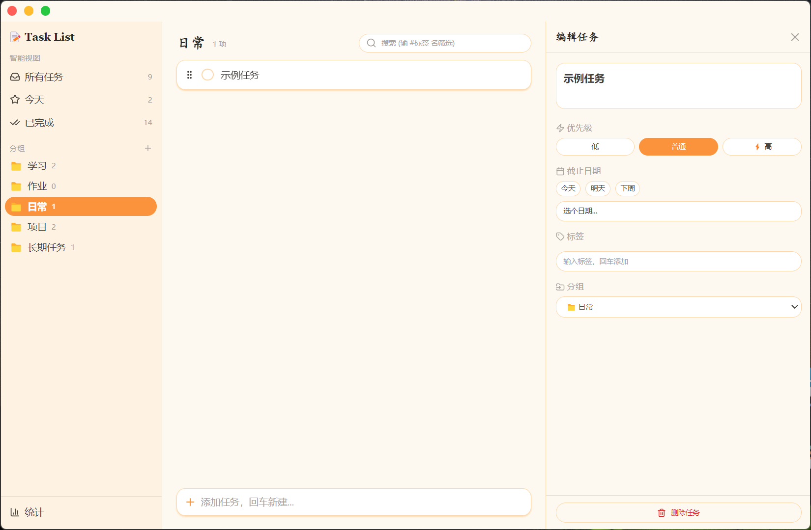
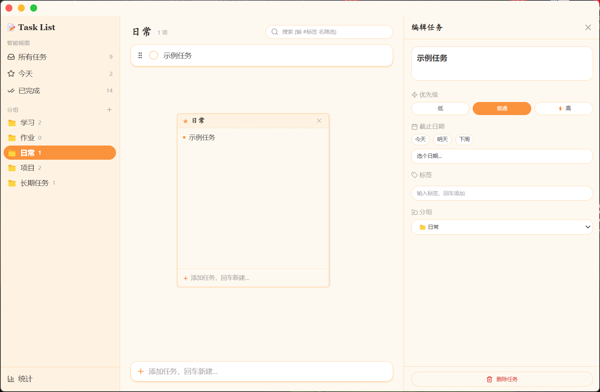

# Task List

一款本地桌面任务清单应用，Warm Paper 暖纸感风格。基于 Electron + React 构建，数据完全存储在本地。


## 功能

- **智能视图** — 所有任务 / 今天 / 已完成，自动按截止日期和优先级聚合
- **分组管理** — 自定义分组，拖拽分组行即可创建浮动便签窗口
- **任务编辑** — 标题、优先级（高/普通/低）、截止日期、标签、分组
- **拖拽排序** — 任务列表支持拖拽重新排序，带视觉反馈
- **搜索与标签** — 全文搜索，`#` 前缀搜索标签，点击标签快速筛选
- **浮动便签** — 从侧边栏拖出分组，生成 Always-on-Top 便签窗口，可独立添加/勾选任务
- **统计面板** — 本周完成数、逾期任务数、8 周完成热力图、各分组完成率
- **系统托盘** — 关闭窗口后藏入托盘，不退出
- **本地存储** — 所有数据保存在 `%APPDATA%/task-list/data.json`，无需联网

## 截图

<div align="center">
  
  <p>主界面：侧边栏 + 任务列表 + 编辑抽屉</p>
</div>

<div align="center">
  
  <p>便签窗口：从侧边栏拖出分组，Always-on-Top 浮动显示</p>
</div>

## 安装

### 下载安装包（Windows）

前往 [Releases](../../releases) 下载最新的 `.exe` 安装包，双击运行即可。

### 从源码构建

**环境要求：** Node.js 22+、npm 10+

```bash
# 克隆仓库
git clone https://github.com/your-username/task-board.git
cd task-board

# 安装依赖
npm install

# 开发模式
npm run dev

# 打包 .exe（需要联网下载 NSIS 工具链）
npm run pack
```

国内网络建议先设置镜像环境变量：

```bash
export ELECTRON_BUILDER_BINARIES_MIRROR=https://npmmirror.com/mirrors/electron-builder-binaries/
export ELECTRON_MIRROR=https://npmmirror.com/mirrors/electron/
```

## 技术栈

| 层 | 技术 |
|---|---|
| 桌面框架 | Electron 33（ESM 主进程） |
| UI | React 18 + Vite |
| 样式 | Tailwind CSS + CSS Variables（Warm Paper 主题） |
| 状态管理 | Zustand |
| 日期处理 | date-fns |
| 日期选择 | react-day-picker |
| 图标 | lucide-react |
| 拖拽排序 | @dnd-kit/core + @dnd-kit/sortable |
| 存储 | JSON 文件（%APPDATA%/task-list/data.json） |
| 测试 | vitest |
| 打包 | electron-builder（NSIS） |

## 项目结构

```
├── electron/              # 主进程
│   ├── main.js            # 窗口管理、IPC、托盘
│   ├── preload.js         # contextBridge API
│   ├── store.js           # JSON 读写 + 数据迁移
│   └── stickyPosition.js  # 便签窗口位置持久化
├── src/                   # React 渲染进程
│   ├── components/        # UI 组件
│   │   ├── Sidebar.jsx    # 侧边栏（视图切换 + 分组 + 拖拽出便签）
│   │   ├── TaskList.jsx   # 任务列表（拖拽排序 + DragOverlay）
│   │   ├── TaskItem.jsx   # 单条任务（sortable）
│   │   ├── TaskEditor.jsx # 任务编辑抽屉
│   │   ├── StickyNote.jsx # 便签窗口
│   │   ├── StatsPanel.jsx # 统计面板
│   │   ├── SearchBar.jsx  # 搜索栏
│   │   ├── QuickAdd.jsx   # 底部快速添加
│   │   ├── TitleBar.jsx   # 自定义标题栏
│   │   └── ErrorBoundary.jsx
│   ├── store/
│   │   └── useTaskStore.js  # Zustand store + 防抖持久化
│   ├── lib/
│   │   ├── dateUtils.js   # 日期工具函数
│   │   ├── filters.js     # 视图筛选 + 标签聚合
│   │   └── id.js          # ID 生成
│   ├── styles/
│   │   └── globals.css    # Tailwind + 设计 token
│   ├── App.jsx
│   └── main.jsx
├── assets/icons/          # 应用图标（SVG 源 + 多尺寸 PNG + ICO）
├── scripts/
│   └── build-icon.js      # SVG → PNG → ICO 生成脚本
├── tests/                 # vitest 单测
├── index.html
├── electron.vite.config.js
├── tailwind.config.js
├── postcss.config.js
└── package.json
```

## 常用命令

| 命令 | 说明 |
|---|---|
| `npm run dev` | 开发模式（热更新） |
| `npm run test` | 运行单测 |
| `npm run test:watch` | 监听模式运行单测 |
| `npm run icon` | 重新生成图标 |
| `npm run pack` | 打包 Windows 安装包（.exe） |

## 数据格式

数据存储在 `%APPDATA%/task-list/data.json`，格式：

```json
{
  "version": 1,
  "groups": [
    { "id": "g_inbox", "name": "未分类", "icon": "📁", "builtin": true }
  ],
  "tasks": [
    {
      "id": "t_xxxx",
      "groupId": "g_inbox",
      "title": "示例任务",
      "completed": false,
      "completedAt": null,
      "priority": "normal",
      "dueDate": "2026-07-08",
      "tags": ["工作"],
      "position": 1000,
      "createdAt": "2026-07-08T12:00:00.000Z"
    }
  ]
}
```

## License

MIT
